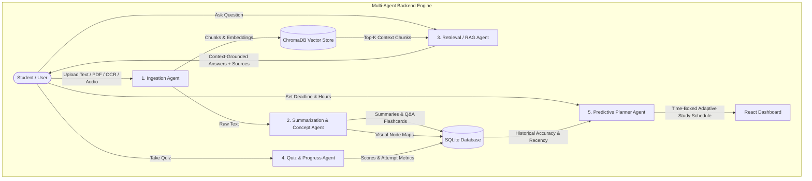

# GURU — Autonomous Agentic AI Study Companion

**GURU** is an agentic, multimodal AI-powered study companion that transforms raw student learning materials (lecture notes, PDF textbooks, scanned image pages, audio voice notes) into a personalized, adaptive study system.

---

## Core Architecture: 5 Cooperating Agents



---

## Hugging Face Models Used

| Stage / Agent | Hugging Face Model | Local Inference / Pipeline | Purpose |
|---|---|---|---|
| **Embeddings (RAG Layer)** | `sentence-transformers/all-MiniLM-L6-v2` | Local `SentenceTransformer()` | Converts text chunks into 384-dim dense vectors for semantic similarity search in ChromaDB |
| **Summarization Agent** | `sshleifer/distilbart-cnn-12-6` / `facebook/bart-large-cnn` | Local HF `pipeline("summarization")` | Synthesizes long notes into concise executive summaries and bullet points |
| **Flashcard & QA Agent** | `google/flan-t5-base` | Local HF `pipeline("text2text-generation")` | Instruction-tuned model for extracting structured Q&A flashcard pairs and grounded QA |
| **Speech-to-Text Ingestion** | `openai/whisper-tiny` / `openai/whisper-small` | Local HF `pipeline("speech-recognition")` | Transcribes student audio voice recordings into plain text chunks |
| **OCR Textbook Ingestion** | `pytesseract` / PIL OCR reader | Local `pytesseract` OCR | Extracts text from scanned textbook page images |

---

## System Features & Capabilities

1. **Multimodal Ingestion Hub**:
   - Plain text notes, PDF uploads, textbook page OCR, and Whisper voice note audio queries.
   - Standardized character/sentence chunking with token overlap.

2. **Concept Explorer & 3D Flashcard Deck**:
   - Interactive 3D flip-cards with self-assessment confidence ratings (Easy ⚡, Medium 🤔, Hard 😓).
   - Dynamic visual concept hierarchy map viewer.

3. **Ask GURU (RAG Tutor Chat)**:
   - Natural language Q&A interface grounded in ingested materials.
   - Provides exact source citations (material title, chunk snippet, relevance score) to prevent hallucinations.

4. **Quiz & Progress Station**:
   - Auto-generates multiple choice quizzes per topic.
   - Evaluates submissions with instant explanations and logs history to SQLite.

5. **Predictive & Agentic Planner**:
   - Explainable scoring algorithm calculating topic weakness:
     $$\text{WeaknessScore} = (1.0 - \text{Accuracy}) \times 4.5 + \text{ExamWeight} \times 3.5 + \text{RecencyFactor} \times 2.0$$
   - Allocates time-boxed daily study schedules based on exam countdown days and student's daily hour target.

---

## Quick Start & Setup Instructions

### Prerequisites
- Node.js (v18+)
- Python (3.10+)

### 1. Run Backend FastAPI Server
```bash
cd backend
python -m pip install -r requirements.txt
python -m uvicorn app.main:app --host 127.0.0.1 --port 8000
```

### 2. Run Frontend Dashboard
```bash
cd frontend
npm install
npm run dev
```

Open browser to `http://localhost:5173`.

---

## Live Demo Walkthrough Steps

1. Click **"Load Seed Materials"** in the top navbar to instantly load CS/AI sample notes (Deep Learning, Database Indexing, Concurrency).
2. Go to **Ingestion Hub** to test plain text, PDF, or image OCR text parsing.
3. Open **Flashcards & Concept Map** to flip 3D study cards and inspect the visual concept node hierarchy.
4. Open **Ask GURU (RAG Chat)** and click a quick prompt like *"What is the function of backpropagation in deep learning?"* to see grounded answers with source citations.
5. Take a quiz in **Quiz Center** and view instant score explanations.
6. Open **Adaptive Planner** to see weak topics ranked and daily study minutes automatically allocated.
